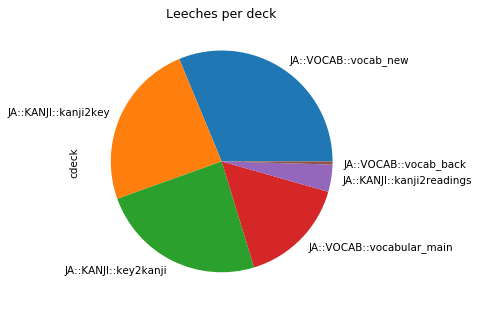
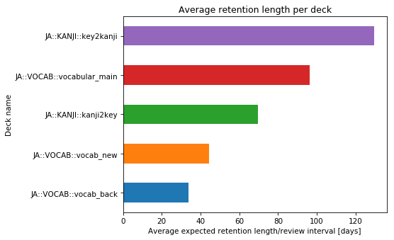
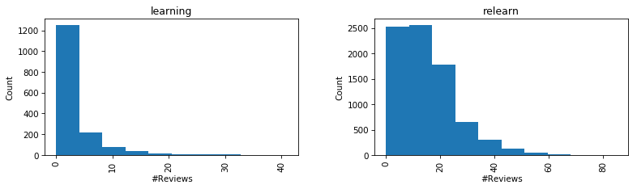
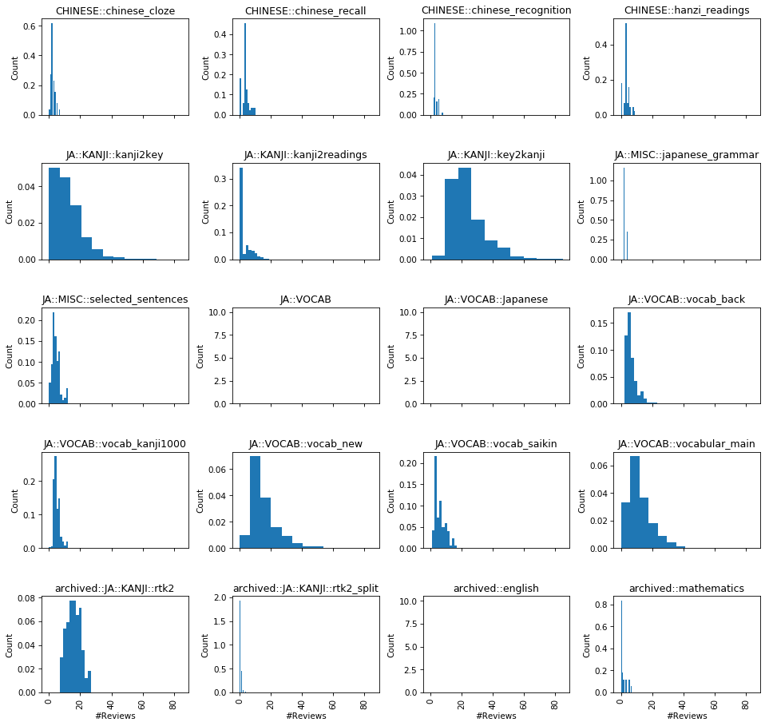
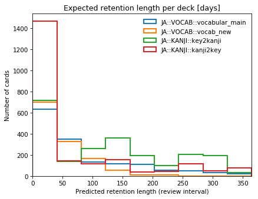
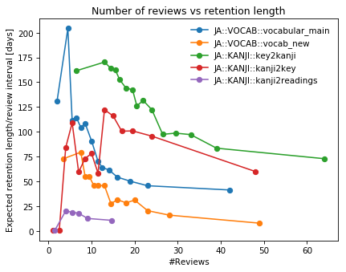

Analysis
========

.. note::

    All examples assume the line

    .. code-block:: python

        col = Collection()

    Or ``col = Collection("/path/to/col.anki2")``, etc.

In which deck are the most leeches?
-----------------------------------

.. literalinclude:: examples/examples/leeches_per_deck.py
    :linenos:

Which deck has the longest average retention rates?
---------------------------------------------------

.. literalinclude:: examples/examples/retention_rate_per_deck.py
    :linenos:

Repetitions vs type
-------------------

Minimal:

.. code-block:: python

    col.cards.hist("crepts", by="ctype")

Prettier:

.. literalinclude:: examples/examples/repetitions_per_type.py
    :linenos:

Repetitions vs deck
-------------------

One liner:

.. code-block:: python

    col.cards.hist(column="creps", by="cdeck")

Prettier:

.. literalinclude:: examples/examples/repetitions_per_deck.py
    :linenos:

Retention distribution vs deck
------------------------------

.. literalinclude:: examples/examples/retention_distribution_vs_deck.py
    :linenos:

Reviews vs retention length vs deck
-----------------------------------

.. literalinclude:: examples/examples/reviews_vs_ease.py
    :linenos:

